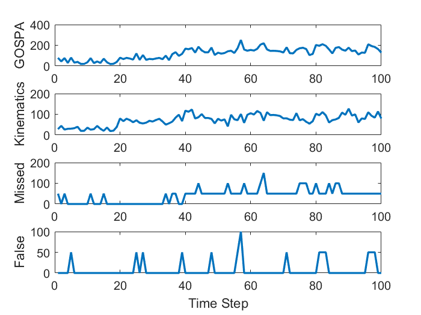
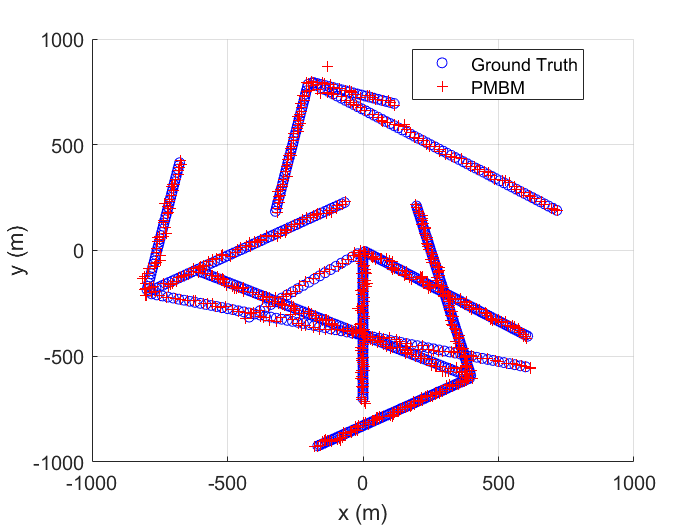

# Multi-Object-Tracking
Repository for the course "Multi-Object Tracking for Automotive Systems" at EDX Chalmers University of Technology

Note: I have completed all assignments in the course and obfuscated key function by using encrypted p files, since it is not
allowed to release solution publicly on github, according to EDX policy. Any interest in implementation details will be discussed
privately.

## Home-Assignment 01 (SA2) - Single-Object Tracking in Clutter
Implementation of the following algorithms:
- [x] Nearest Neighbors Filter (NN)
- [x] Probabilistic Data Association Filter (PDA)
- [x] Gaussian Sum Filter (GSF)

The main class is located at [SA2/singleobjectracker.p](./SA2/singleobjectracker.p)

Simulations can be done using  [SA2/simulation1.mlx](./SA2/simulation1.mlx) 

## Home-Assignment 02 (SA3) - Tracking n Objects in Clutter
Implementation of the following algorithms:
- [x] Global Nearest Neighbors Filter (GNN)
- [x] Joint Probabilistic Data Association Filter (JPDA)
- [x] Track-oriented Multiple Hypothesis Tracker (TO-MHT)

The main class is located at [SA3/n_objectracker.p](./SA3/n_objectracker.p)

Simulations can be done using  [SA3/simulation2.mlx](./SA3/simulation2.mlx) 

## Home-Assignment 03 (SA4) - Random Finite Sets
Implementation of the following algorithms:
- [x] Probability Hypothesis Density Filter (PHD)

The main class is located at [SA4/PHDfilter.p](./SA4/PHDfilter.p)

Simulations can be done using  [SA4/simulation3.mlx](./SA4/simulation3.mlx) 

Filter output|             
:-------------------------:|
|

Cardinality Estimation             |  GOSPA
:-------------------------:|:-------------------------:
  |  

## Home-Assignment 04 (SA5) - MOT Using Conjugate Priors
Implementation of the following algorithms:
- [x] Poisson Multi-Bernoulli Mixture filter (PMBM)

The main class is located at [SA5/PMBMfilter.p](./SA5/PMBMfilter.p)

Simulations can be done using  [SA5/simulation4.mlx](./SA5/simulation4.mlx)

Filter output|             
:-------------------------:|
|

Cardinality Estimation             |  GOSPA
:-------------------------:|:-------------------------:
 |  
